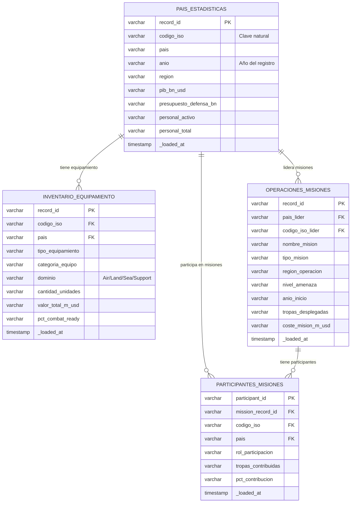

# Modelo Relacional — NATO Data

## Relaciones

| Relación | Tipo | Descripción |
|---|---|---|
| `PAIS_ESTADISTICAS` → `INVENTARIO_EQUIPAMIENTO` | 1:N | Un país tiene múltiples registros de equipamiento |
| `PAIS_ESTADISTICAS` → `OPERACIONES_MISIONES` | 1:N | Un país puede liderar múltiples misiones |
| `PAIS_ESTADISTICAS` → `PARTICIPANTES_MISIONES` | 1:N | Un país puede participar en múltiples misiones |
| `OPERACIONES_MISIONES` → `PARTICIPANTES_MISIONES` | 1:N | Una misión tiene múltiples países participantes |

## Notas
- Todos los campos son `VARCHAR` en Bronze (capa de aterrizaje sin casteo)
- Los tipos se castean en Silver (`stg_nato__*`)
- La clave natural de país es `codigo_iso` — `record_id` no garantiza unicidad en todos los casos
